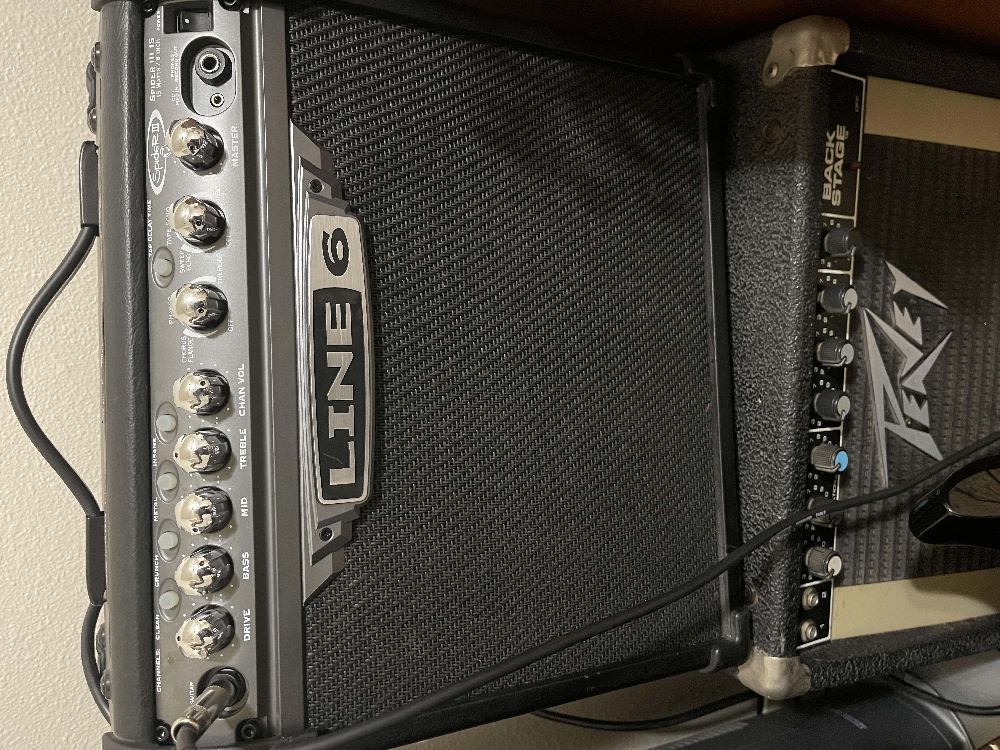

# Rocking with Dials

## By Andrew Moskowitz on 3/10/2023

I recently acquired a new guitar amplifier that I am very much enjoying now that I have mastered the controls. The process of learning all the buttons and dials was quite the ordeal though, as there are multiple words and symbols that up until now I did not know could be used to describe effects that manipulate the sound of a guitar. My **overall goal** of interacting with this new amp was to find my perfect sound and volume to resume my playing. 

Once I unboxed my new amp, I took a minute to look it over and started to make a **mental model** of how this piece of technology worked and how I was going to interact with it. I had used a number of amplifiers before but this was a different brand and had more buttons and knobs that I had ever previously seen along with words I had never seen before. 

After building a sufficient mental model, the **first action** I took with the amp was to plug in the power cord between it and the wall socket. This was very intuitive since I assumed something this size required an outside power source and did not run on battery power. All of my previous amps had power cables as well. After this, I turned the power button on and connected my guitar to the amplifier via the guitar cable. All of this was going great but now it was time to figure out just what all these buttons and knobs were for. I decided to set all the knobs to the lowest setting and strum a note while slowly increasing the volume until I had a decent sound that was loud enough to hear and enjoy but quiet enough to keep my neighbors from calling the police for a noise complaint. 

The easy part was over, diving now into uncharted territories I started to slightly turn the knobs from left to right until I liked what I heard. Each new knob I tried I went back and slightly modified the others if I felt like it would sound better or more **enjoyable**. After I had found a sufficient setting which sounded like a good rock guitar, I started to mess with the looping and echo effects. These I did not really care for since I have not spent the time to learn how to properly use them in the past and I was on a mission to find my perfect guitar sound that I had found in the past on previous amps. After the knobs were all turned in the **correct position**, I looked to the buttons on the top left of the amp and cycled through each of them to see which sound I liked best. I settled on the metal setting since I enjoy playing Metallica songs and this sounded the most fitting.

In the end, I ended up finding my perfect sound that I had been searching for which made for a very high **effective** grade for this amp. As for **efficiency**, without a guide on how to specifically interact with everything this amplifier had to offer I had to resort to testing each and every element of it to fully understand what I was dealing with and how it related to my **intended outcome**. Aside from wanting to kick the amp from time to time for not getting the exact pitch I was looking for, and the occasional turn of the volume knob too high, I would say the **safety** of this amp was top notch. When it comes to the **satisfaction** of this amplifier, I cannot give a high enough grade. The vast spectrum and quality of sounds it is able to create as well as the sleek layout and smooth portability is a **major strength** and makes this one of, if not the best amp I have every played on. As mentioned before, this amp did not come with a users’ guide which required that I manually test and interact with everything to figure out and understand what all the words and symbols meant which in my opinion would be a big weakness. While this took a while and was aggravating at times due to the system not being the most **error tolerant** (meaning the knobs were very sensitive and a slight bump against one would change the sound drastically), it only took a day or two to start to understand what knob to turn or button to press when searching for a new sound effect which gives the **learnability** score of above average. But to make up for a mediocre learnability score, having to go through everything on my own made it that much more **memorable** and in the long run, fun! After this whole experience, I would say that I am extremely satisfied with my purchase and interaction with this new amplifier and it is exactly what I was looking for making it have a perfect score of **usefulness**. 

